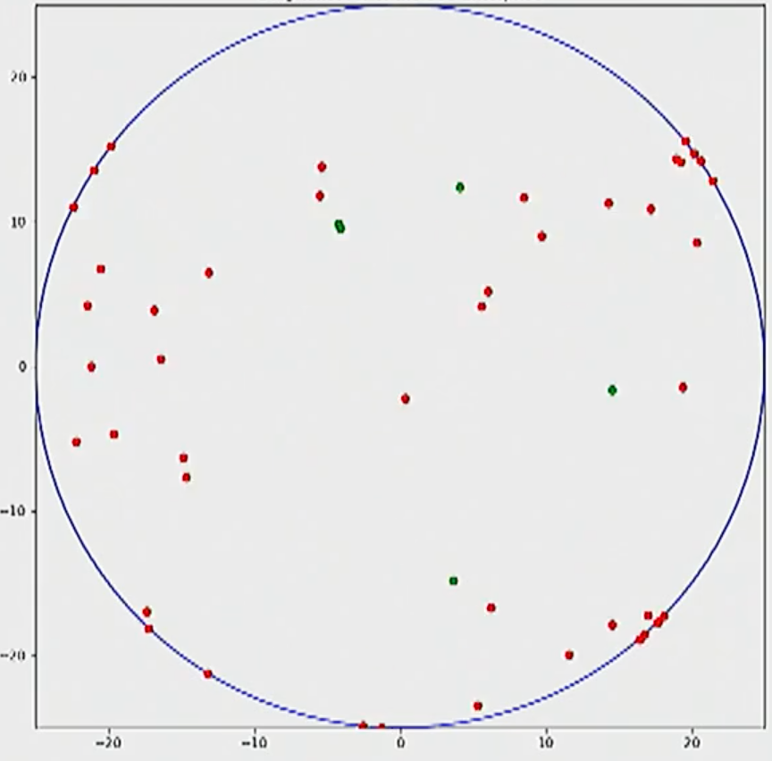

# AAE560-Tag
This tag game was conditioning game we played for tennis. The basic premise is tag, but half of use would stand in a circle while the other half plays. The half not playing would do jumping jacks. The half that is playing would be split into two teams. A few 'chasers' and the majority are 'runners.' The chasers would tag the runners. Runners who were tagged would stand at the edge of the circle to join in with jumping jacks. The game ends when all runners are tagged. 

This agent-based model simulates the behavior of tagging.

